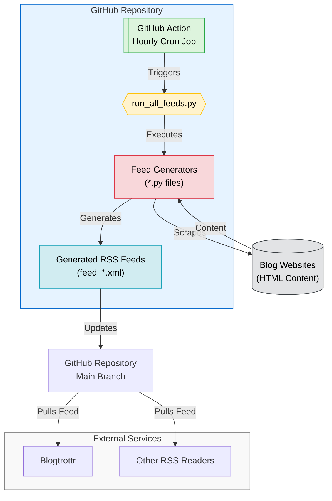

# RSS Feed Generator <!-- omit in toc -->

> [!TIP]
> This project is maintained by [@oborchers](https://github.com/oborchers) and [@Olshansk](https://github.com/Olshansk). If you gut any value out of it, consider sponsoring us on GitHub!

> [!NOTE]
> Read the blog post about this repo: [No RSS Feed? No Problem. Using Claude to automate RSS feeds.](https://olshansky.substack.com/p/no-rss-feed-no-problem-using-claude)

## tl;dr Available RSS Feeds <!-- omit in toc -->

Scraped feeds are generated hourly. "Official RSS" rows point to native feeds the blog now publishes directly.

| Blog                                                                                              | Feed                                                                                                                                 |
| ------------------------------------------------------------------------------------------------- | ------------------------------------------------------------------------------------------------------------------------------------ |
| [AI at Meta Blog](https://ai.meta.com/blog/)                                                      | [feed_meta_ai.xml](https://raw.githubusercontent.com/Olshansk/rss-feeds/main/feeds/feed_meta_ai.xml)                                 |
| [AI FIRST Podcast](https://ai-first.ai/podcast) (German)                                          | [feed_ai_first_podcast.xml](https://raw.githubusercontent.com/Olshansk/rss-feeds/main/feeds/feed_ai_first_podcast.xml)               |
| [AISI Blog](https://www.aisi.gov.uk/blog)                                                         | [feed_aisi.xml](https://raw.githubusercontent.com/Olshansk/rss-feeds/main/feeds/feed_aisi.xml)                                       |
| [Anthropic Engineering](https://www.anthropic.com/engineering)                                    | [feed_anthropic_engineering.xml](https://raw.githubusercontent.com/Olshansk/rss-feeds/main/feeds/feed_anthropic_engineering.xml)     |
| [Anthropic Frontier Red Team](https://red.anthropic.com/)                                         | [feed_anthropic_red.xml](https://raw.githubusercontent.com/Olshansk/rss-feeds/main/feeds/feed_anthropic_red.xml)                     |
| [Anthropic News](https://www.anthropic.com/news)                                                  | [feed_anthropic_news.xml](https://raw.githubusercontent.com/Olshansk/rss-feeds/main/feeds/feed_anthropic_news.xml)                   |
| [Anthropic Research](https://www.anthropic.com/research)                                          | [feed_anthropic_research.xml](https://raw.githubusercontent.com/Olshansk/rss-feeds/main/feeds/feed_anthropic_research.xml)           |
| [Apollo Research - Governance](https://www.apolloresearch.ai/governance/)                         | [feed_apollo_governance.xml](https://raw.githubusercontent.com/Olshansk/rss-feeds/main/feeds/feed_apollo_governance.xml)             |
| [Apollo Research - Monitoring](https://www.apolloresearch.ai/monitoring/)                         | [feed_apollo_monitoring.xml](https://raw.githubusercontent.com/Olshansk/rss-feeds/main/feeds/feed_apollo_monitoring.xml)             |
| [Apollo Research - Science](https://www.apolloresearch.ai/science/)                               | [feed_apollo_science.xml](https://raw.githubusercontent.com/Olshansk/rss-feeds/main/feeds/feed_apollo_science.xml)                   |
| [Chander Ramesh's Writing](https://chanderramesh.com/writing)                                     | [feed_chanderramesh.xml](https://raw.githubusercontent.com/Olshansk/rss-feeds/main/feeds/feed_chanderramesh.xml)                     |
| [Claude Blog](https://claude.com/blog)                                                            | [feed_claude.xml](https://raw.githubusercontent.com/Olshansk/rss-feeds/main/feeds/feed_claude.xml)                                   |
| [Claude Code Changelog](https://code.claude.com/docs/en/changelog)                                | [Official RSS](https://code.claude.com/docs/en/changelog/rss.xml)                                                                    |
| [Cloudflare skills (commits/main)](https://github.com/cloudflare/skills)                          | [Official RSS](https://github.com/cloudflare/skills/commits/main.atom)                                                               |
| [Cohere Blog](https://cohere.com/blog)                                                            | [feed_cohere.xml](https://raw.githubusercontent.com/Olshansk/rss-feeds/main/feeds/feed_cohere.xml)                                   |
| [Cursor Blog](https://cursor.com/blog)                                                            | [feed_cursor.xml](https://raw.githubusercontent.com/Olshansk/rss-feeds/main/feeds/feed_cursor.xml)                                   |
| [Dagster Blog](https://dagster.io/blog)                                                           | [feed_dagster.xml](https://raw.githubusercontent.com/Olshansk/rss-feeds/main/feeds/feed_dagster.xml)                                 |
| [EleutherAI Papers](https://www.eleuther.ai/papers)                                               | [feed_eleuther_papers.xml](https://raw.githubusercontent.com/Olshansk/rss-feeds/main/feeds/feed_eleuther_papers.xml)                 |
| [FAR.AI Publications](https://www.far.ai/publications)                                            | [feed_far_ai.xml](https://raw.githubusercontent.com/Olshansk/rss-feeds/main/feeds/feed_far_ai.xml)                                   |
| [Goodfire Research](https://www.goodfire.ai/research)                                             | [feed_goodfire.xml](https://raw.githubusercontent.com/Olshansk/rss-feeds/main/feeds/feed_goodfire.xml)                               |
| [Google DeepMind Blog](https://deepmind.google/blog/)                                             | [Official RSS](https://deepmind.google/blog/rss.xml)                                                                                 |
| [Google Developers Blog - AI](https://developers.googleblog.com/search/?technology_categories=AI) | [feed_google_ai.xml](https://raw.githubusercontent.com/Olshansk/rss-feeds/main/feeds/feed_google_ai.xml)                             |
| [Groq Blog](https://groq.com/blog/)                                                               | [feed_groq.xml](https://raw.githubusercontent.com/Olshansk/rss-feeds/main/feeds/feed_groq.xml)                                       |
| [Hamel Husain's Blog](https://hamel.dev/)                                                         | [Official RSS](https://hamel.dev/index.xml)                                                                                          |
| [Interconnected (Matt Webb)](https://interconnected.org/home)                                     | [Official RSS](https://interconnected.org/home/feed)                                                                                 |
| [Mistral AI News](https://mistral.ai/news)                                                        | [feed_mistral.xml](https://raw.githubusercontent.com/Olshansk/rss-feeds/main/feeds/feed_mistral.xml)                                 |
| [Ollama Blog](https://ollama.com/blog)                                                            | [feed_ollama.xml](https://raw.githubusercontent.com/Olshansk/rss-feeds/main/feeds/feed_ollama.xml)                                   |
| [OpenAI Engineering](https://openai.com/news/engineering/)                                        | [Official RSS](https://openai.com/news/engineering/rss.xml)                                                                          |
| [OpenAI Research](https://openai.com/news/research/)                                              | [Official RSS](https://openai.com/blog/rss.xml)                                                                                      |
| [Paul Graham's Articles](https://www.paulgraham.com/articles.html)                                | [feed_paulgraham.xml](https://raw.githubusercontent.com/Olshansk/rss-feeds/main/feeds/feed_paulgraham.xml)                           |
| [Perplexity Hub](https://www.perplexity.ai/hub)                                                   | [feed_perplexity_hub.xml](https://raw.githubusercontent.com/Olshansk/rss-feeds/main/feeds/feed_perplexity_hub.xml)                   |
| [Pinecone Blog](https://www.pinecone.io/blog/)                                                    | [feed_pinecone.xml](https://raw.githubusercontent.com/Olshansk/rss-feeds/main/feeds/feed_pinecone.xml)                               |
| [Simon Willison's Blog (Tools)](https://simonwillison.net/)                                       | [Official RSS](https://simonwillison.net/atom/beats/tool/)                                                                           |
| [Supabase Blog](https://supabase.com/blog)                                                        | [Official RSS](https://supabase.com/rss.xml)                                                                                         |
| [Surge AI Blog](https://www.surgehq.ai/blog)                                                      | [feed_blogsurgeai.xml](https://raw.githubusercontent.com/Olshansk/rss-feeds/main/feeds/feed_blogsurgeai.xml)                         |
| [The Batch by DeepLearning.AI](https://www.deeplearning.ai/the-batch/)                            | [feed_the_batch.xml](https://raw.githubusercontent.com/Olshansk/rss-feeds/main/feeds/feed_the_batch.xml)                             |
| [Thinking Machines Lab](https://thinkingmachines.ai/blog/)                                        | [Official RSS](https://thinkingmachines.ai/blog/index.xml)                                                                           |
| [Timaeus Research](https://timaeus.co/research)                                                   | [feed_timaeus.xml](https://raw.githubusercontent.com/Olshansk/rss-feeds/main/feeds/feed_timaeus.xml)                                 |
| [Transluce Research](https://transluce.org/research)                                              | [feed_transluce.xml](https://raw.githubusercontent.com/Olshansk/rss-feeds/main/feeds/feed_transluce.xml)                             |
| [Weaviate Blog](https://weaviate.io/blog)                                                         | [feed_weaviate.xml](https://raw.githubusercontent.com/Olshansk/rss-feeds/main/feeds/feed_weaviate.xml)                               |
| [Windsurf Blog](https://windsurf.com/blog)                                                        | [feed_windsurf_blog.xml](https://raw.githubusercontent.com/Olshansk/rss-feeds/main/feeds/feed_windsurf_blog.xml)                     |
| [Windsurf Changelog](https://windsurf.com/changelog)                                              | [feed_windsurf_changelog.xml](https://raw.githubusercontent.com/Olshansk/rss-feeds/main/feeds/feed_windsurf_changelog.xml)           |
| [Windsurf Next Changelog](https://windsurf.com/changelog/windsurf-next)                           | [feed_windsurf_next_changelog.xml](https://raw.githubusercontent.com/Olshansk/rss-feeds/main/feeds/feed_windsurf_next_changelog.xml) |
| [xAI News](https://x.ai/news)                                                                     | [feed_xainews.xml](https://raw.githubusercontent.com/Olshansk/rss-feeds/main/feeds/feed_xainews.xml)                                 |

### Planned <!-- omit in toc -->

| Blog                                                           | Status    |
| -------------------------------------------------------------- | --------- |
| [David Crawshaw](https://crawshaw.io/)                         | _planned_ |
| [Engineering.fyi](https://engineering.fyi/)                    | _planned_ |
| [Patrick Collison's Blog](https://patrickcollison.com/culture) | _planned_ |

### What is this?

You know that blog you like that doesn't have an RSS feed and might never will?

🙌 **You can use this repo to create a RSS feed for it!** 🙌

## Table of Contents <!-- omit in toc -->

- [Quick Start](#quick-start)
  - [Subscribe to a Feed](#subscribe-to-a-feed)
  - [Request a new Feed](#request-a-new-feed)
- [Create a new a Feed](#create-a-new-a-feed)
- [Star History](#star-history)
- [Ideas](#ideas)
- [How It Works](#how-it-works)
  - [For Developers 👀 only](#for-developers--only)

## Quick Start

### Subscribe to a Feed

- Go to the [feeds directory](./feeds).
- Find the feed you want to subscribe to.
- Use the **raw** link for your RSS reader. Example:

  ```text
    https://raw.githubusercontent.com/Olshansk/rss-feeds/main/feeds/feed_ollama.xml
  ```

- Use your RSS reader of choice to subscribe to the feed (e.g., [Blogtrottr](https://blogtrottr.com/)).

### Request a new Feed

Want me to create a feed for you?

[Open a GitHub issue](https://github.com/Olshansk/rss-feeds/issues/new?template=request_rss_feed.md) and include the blog URL.

If I do, consider supporting my 🌟🧋 addiction by [buying me a coffee](https://buymeacoffee.com/olshansky).

## Create a new a Feed

1. Download the HTML of the blog you want to create a feed for.
2. Open Claude Code CLI
3. Tell claude to:

```bash
Use /cmd-rss-feed-generator to convert @<html_file>.html to a RSS feed for <blog_url>.
```

## Star History

[](https://star-history.com/#Olshansk/rss-feeds&Date)

## Ideas

- **X RSS Feed**: Going to `x.com/{USER}/index.xml` should give an RSS feed of the user's tweets.

## How It Works



### For Developers 👀 only

- Open source and community-driven 🙌
- Simple Python + GitHub Actions 🐍
- AI tooling for easy contributions 🤖
- Learn and contribute together 🧑‍🎓
- Streamlines the use of Claude, Claude Projects, and Claude Sync
